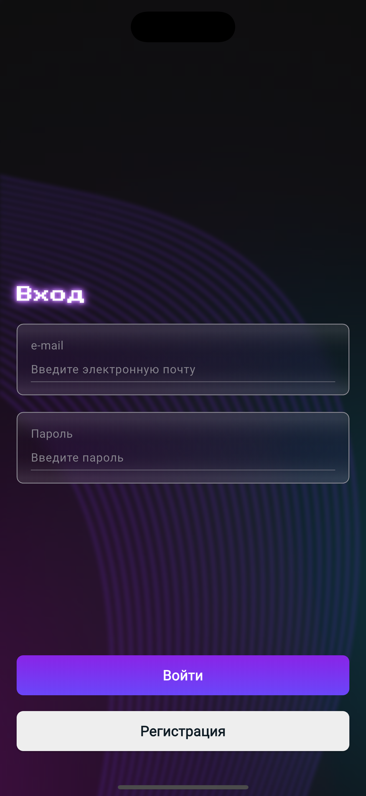
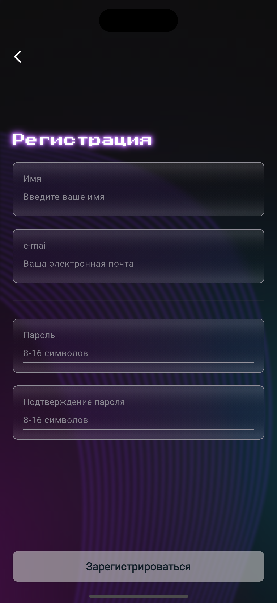
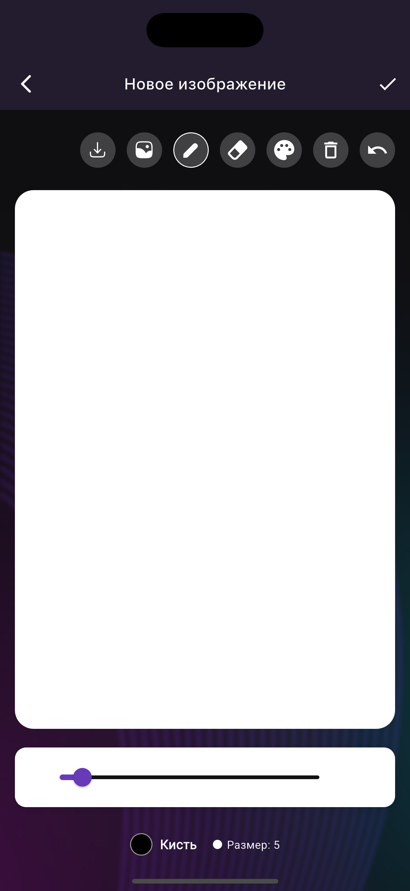
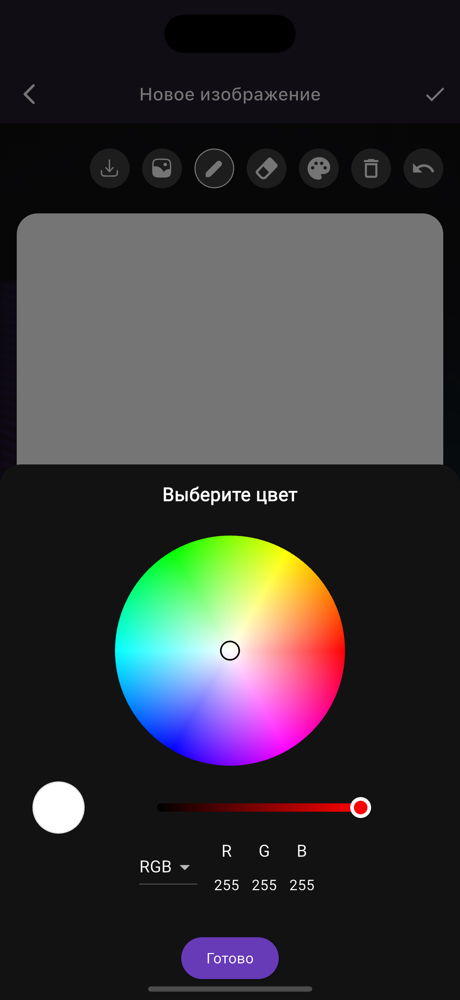
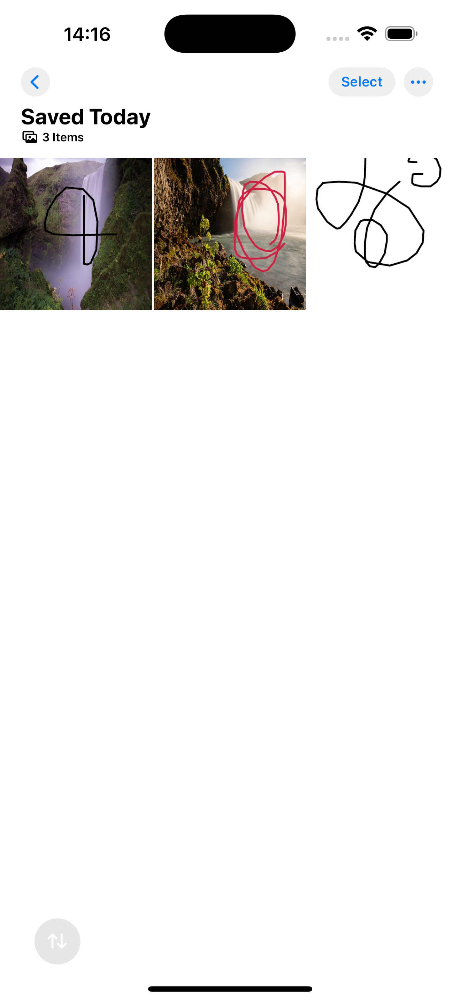

# Drawing App - Flutter Cross-Platform Application

Мобильное кроссплатформенное приложение для рисования с интеграцией Firebase, созданное на Flutter с использованием Clean Architecture и BLoC pattern.

## 🎯 Функциональность

- **Авторизация и регистрация** через Firebase Auth с валидацией
- **Редактор рисования** с настройкой кисти (размер 1-50px, цвет)
- **Режим ластика** и отмена последнего штриха (Undo)
- **Импорт изображений** из галереи как фон
- **Экспорт** через Share-попап и в галерею устройства
- **Галерея рисунков** с thumbnail превью и pull-to-refresh
- **Редактирование и удаление** рисунков с подтверждением
- **Хранение в Firestore** (Base64, метаданные)
- **Локальные уведомления** при сохранении и экспорте
- **Офлайн режим** с проверкой соединения
- **Thumbnail memory caching** - 10-15x быстрее загрузка

## 🏗️ Архитектура

Проект реализован с использованием **Clean Architecture** и **Feature-First** подхода:

```
lib/
├── core/               # Кеш, константы, сервисы, утилиты, виджеты
└── features/           # Auth, Gallery, Drawing
    ├── data/          # Models, DataSources, Repository Impl
    ├── domain/        # Entities, Repository Interface, Use Cases
    └── presentation/  # BLoC, Screens, Widgets
```

### Паттерны
- **BLoC** для state management
- **Repository** для абстракции данных
- **Dependency Injection** через GetIt
- **Either Pattern** (Dartz) для обработки ошибок

## 🛠️ Технологический стек

```yaml
dependencies:
  firebase_core: ^3.6.0
  firebase_auth: ^5.3.1
  cloud_firestore: ^5.4.4
  flutter_bloc: ^8.1.6
  get_it: ^8.0.0
  dartz: ^0.10.1
  flutter_colorpicker: ^1.1.0
  image_picker: ^1.1.2
  flutter_local_notifications: ^18.0.1
  share_plus: ^10.1.1
  connectivity_plus: ^6.0.5
  google_fonts: ^6.2.1
```

## 🚀 Установка и запуск

### 1. Клонировать репозиторий
```bash
git clone https://github.com/your-username/drawing_app.git
cd drawing_app
```

### 2. Установить зависимости
```bash
flutter pub get
```

### 3. iOS Setup (macOS only)
```bash
cd ios
pod install
cd ..
```

### 4. Настроить Firebase
```bash
# Установить FlutterFire CLI
dart pub global activate flutterfire_cli

# Настроить Firebase
flutterfire configure
# Выбрать: [x] android, [x] ios
```

Включить в Firebase Console:
- Authentication → Email/Password
- Firestore Database

Создать Firestore composite index для галереи:
- Collection: `drawings`
- Fields: `userId` (Ascending), `date` (Descending)

### 5. Запустить приложение
```bash
# iOS
flutter run -d "iPhone 15 Pro"

# Android
flutter run
```

## 📱 Поддерживаемые платформы

- **iOS:** 12.0+
- **Android:** API 21+ (Android 5.0)

## 🔨 Сборка Release

**Android APK:**
```bash
flutter build apk --release
```

**iOS:**
```bash
flutter build ios --release
# Далее через Xcode: Product → Archive
```

## 📱 Скриншоты

| Авторизация | Редактор | Галерея |
|-------------|----------|---------|
| <br> |  |  |

| Выбор цвета | Экспорт | Уведомление |
|-------------|---------|-------------|
|  |  |  |